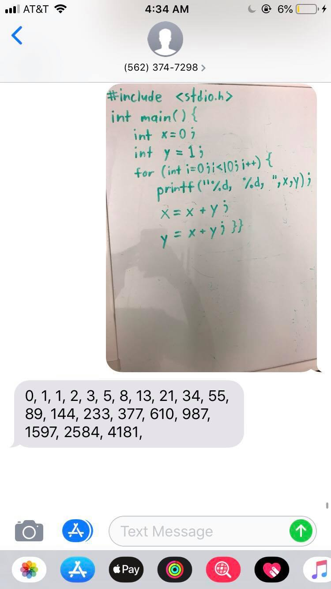
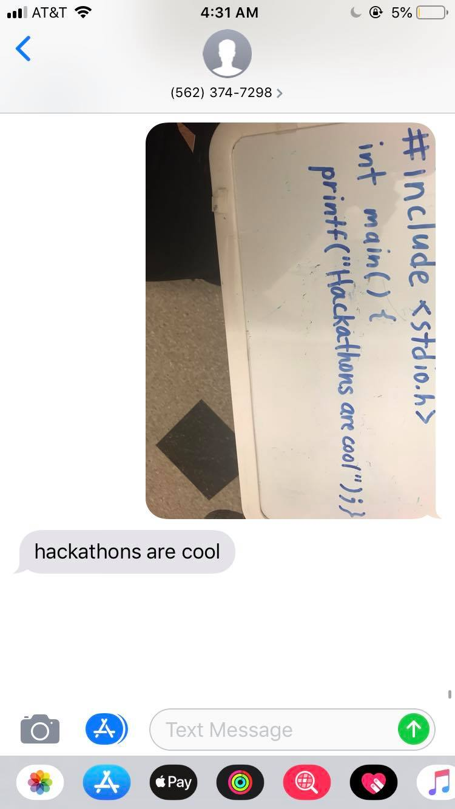
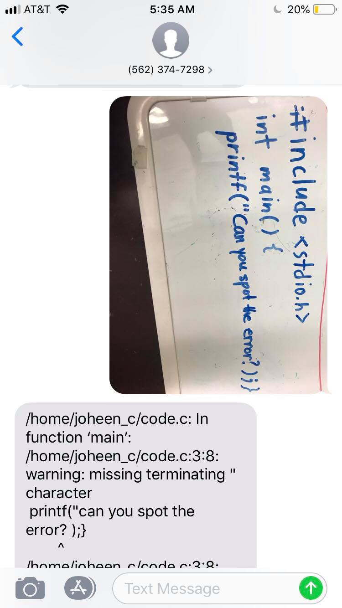
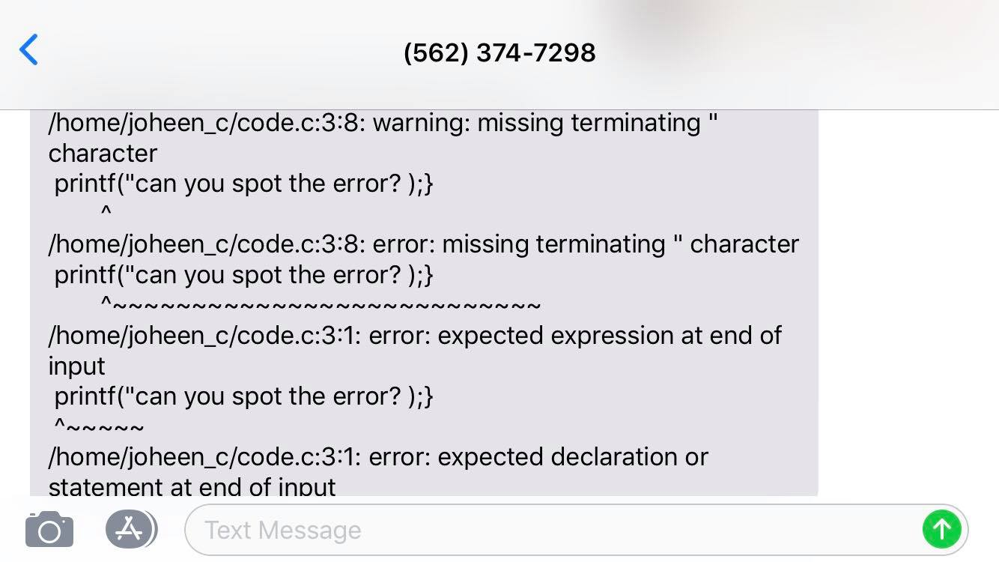

# PicCode

Created at DevFest 2019 at Columbia University by Alexander Wang, Ursula Ott, Joheen Chakraborty, and Michael Jan.

## Project Overview
### Motivation
Whiteboarding, coding by hand, and reading code in the form of physical text (via textbook or otherwise) are common among programmers and CS students - but it is rather inconvenient when one wishes to compile and test such code. Thus, an easy method of converting such "physical" code into machine-parsable and runnable "real" code would be very helpful.

### Description
PicCode enables you to text a picture of handwritten C code to a special phone number, and receive the stdout output texted right back to them after compiling and running the code. Furthermore, the service texts meaningful debug messages if your code is can't compile or causes a runtime error. Whiteboarding often results in buggy code that is hard to verify without compiling, which is why being able to do it all on your phone is a huge plus. Here, one can quickly verify any handwritten code by simply taking a picture.

## How We Did It
We set the entire service up on a Google Cloud Compute Engine (a virtual machine, or VM), so it's always running, with no need to be hosted by a local machine. A Python+Flask+ngrok program was used to receive the image from Twilio and to send the response back to the user (also via Twilio). The Google Vision Cloud API (specifically its Optical Character Recognition) was used to help with the handwriting-to-code conversion. Within the Google Cloud VM, we wrote a shell script that would essentially compile the programs, determine any errors/outputs, and then send it back to Twilio via the aforementioned python program. We've tested our platform across multiple mediums - including printer paper, lined paper, blackboards, and whiteboards - with much success.

### Technologies Used
Google Cloud (Optical Character Recogniton and Compute Engine), Twilio API, Python, Flask, ngrok

## Example Usage

  
  
Example of error feedback to help debug.
  

### Future Visions
* Expand the possible code to more than just C. First steps would probably be Python and Java, which are among the most popular programming languages today.

* Look at ways to improve the accuracy of the machine learning text to code algorithm. Currently, we've coded some basic algorithms that correct simple compiler mistakes (missing semicolons for example). But the Google Cloud OCR tool is trained on English grammar and vocabulary, which is less accurate than training a model on code from the ground up. There are also a number of research papers (ex. https://arxiv.org/pdf/1801.10467.pdf) that use deep learning text investigating to correct code for syntax errors after the fact, and, given a dataset of programs, we'd be able to  better train our own text recognition machine learning model.

